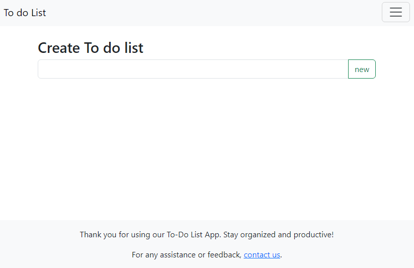

# To Do List App

A simple To-Do List application built using Django to practice and enhance development skills.

## Tech/Framework Used

Built with Django, this project leverages Python for backend functionality and integrates with HTML/CSS for front-end rendering.

## Screenshots and Demo

## Installation

For developers interested in running this application locally:

1. Clone this repository.
2. Navigate to the project directory.
3. Create a virtual environment: `python -m venv env`
4. Activate the virtual environment: 
   - On Windows: `.\env\Scripts\activate`
   - On macOS/Linux: `source env/bin/activate`
5. Install project dependencies: `pip install -r requirements.txt`
6. Apply database migrations: `python manage.py migrate`
7. Run the development server: `python manage.py runserver`
8. Access the application at `http://localhost:8000/`

## Usage

This application facilitates efficient task management by allowing users to:

- Create multiple task lists for better organization.
- Add, edit, and delete tasks within each list.
- Mark tasks as completed for easy tracking.

## Areas for Improvement

While this project serves as a practice exercise, there are several areas where enhancements could be considered:

- **Backend Authentication Handling**: Refactor authentication logic to be handled primarily in the backend/controllers rather than within HTML templates. This separation of concerns ensures better security practices and makes the application's authentication flow more robust and maintainable.
- **Frontend Enhancement**: Improve the UI/UX for a more visually appealing experience.
- **Task Prioritization**: Introduce a feature for task prioritization within lists.

## License

This project is licensed under the [MIT License](https://choosealicense.com/licenses/mit/). Feel free to explore and modify as needed.
